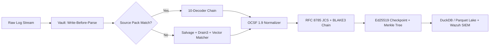

# SIH26156 Final Evaluation Pitch Deck
**Smart India Hackathon 2026**  
**Category:** Software | **Theme:** Blockchain & Cybersecurity  
**Problem Statement ID:** SIH26156 | **Organization:** NTRO  
**Team Name:** LunarX | **Idea 2:** Universal Log Pre-processing Framework (ULPF)  
*(Note: Team LunarX already shortlisted in internal hackathon with SIH26166 ISRO)*

---

### SLIDE 1: Title & Team Credentials
- **Problem Statement ID:** SIH26156
- **Problem Title:** Universal Log Pre-processing Framework (ULPF)
- **Theme:** Blockchain & Cybersecurity
- **Category:** Software
- **Organization:** National Technical Research Organisation (NTRO)
- **Team Name:** LunarX
- **Submission Type:** Final Round Submission (Idea 2)

---

### SLIDE 2: Proposed Solution & Core Innovation
**"Any Log In, OCSF 1.9 Out, Zero Bytes Dropped, Cryptographically Proved."**
- **3-Tier Architecture:**
  1. **Tier 1 (Vault-First Lossless Capture):** Raw bytes written to append-only zstd blocks with CRC-32 before parsing. Deterministic `ulpf:raw:<seg>:<off>:<len>` locator assigned.
  2. **Tier 2 (Telemetry-Aware Vector Matcher + Drain3):** Novel offline 384-dim semantic embedding `key | samples | type` mapped against canonical OCSF 1.9 schema. Confidence routing: $>0.85$ auto-maps, $0.60-0.85$ human review queue, $<0.60$ custom fallback.
  3. **Tier 3 (Tamper-Evident Hash Chain & Merkle Trees):** RFC 8785 JCS canonicalization + BLAKE3 hash chain ($H_N = \text{Hash}(E_N + H_{N-1})$) + Ed25519 digital checkpoint signatures + RFC 6962 Merkle inclusion proofs in $\lceil \log_2 N \rceil$ hashes.

---

### SLIDE 3: Technical Approach & Architecture Flow
| Component | Technology | Technical Purpose |
|---|---|---|
| **Raw Storage Vault** | Zstandard + CRC-32 + ChaCha20-Poly1305 | Write-Before-Parse lossless capture, 500x+ compression ratio |
| **Decoders & Parsers** | 10 Decoders + YAML Source Packs | Hot-path regex/string matcher; 400ms burst-coalescing hot-reload |
| **Novel Vector Matcher** | 384-dim Semantic Projection + Cosine Sim | Telemetry-aware field matching without LLM code gen (Air-Gap Safe) |
| **Normalization** | OCSF 1.9 (Classes 4001, 3001, 2001, 1001) | Canonical cybersecurity ontology, 7-stage lineage tracking |
| **Attestation** | RFC 8785 JCS + BLAKE3 + Ed25519 + RFC 6962 | Blockchain-grade tamper evidence; zero-knowledge inclusion proofs |
| **Analytical Lake & SDK** | DuckDB + PyArrow + Parquet | Sub-second SQL queries, predicate pushdown, ML-ready feature matrices |

---

### SLIDE 4: Feasibility, Edge Cases & Risk Mitigation
1. **High Ingestion Burst / Backpressure Risk:**  
   *Mitigation:* Bounded asynchronous memory buffers, 1MiB zstd block flushes, and DuckDB `executemany` batch transactions exceeding 8,000 EPS.
2. **Crash & Storage Corruption Risk:**  
   *Mitigation:* Index is an optimization, not the source of truth. `recover_index()` reconstructs segment indices directly by scanning 32-byte block headers on reboot.
3. **Air-Gapped Network Isolation (NTRO Requirement):**  
   *Mitigation:* 100% offline self-contained mathematical embeddings. Tested and proven with zero external network socket calls.
4. **Adversary Log Tampering / Insider Threat:**  
   *Mitigation:* Any unauthorized SQL update to a database field immediately breaks the JCS hash chain at the exact sequence number.
5. **False Positive Field Mapping Risk:**  
   *Mitigation:* Salvage extraction extracts raw tokens without guessing roles; 3-tier confidence routing ensures uncertain mappings ($0.60-0.85$) require Human-in-the-Loop promotion.

---

### SLIDE 5: Impact & Benefits to NTRO & National Security
- **10x Faster Vendor Onboarding:** New firewall or sensor onboarded in $<5$ minutes by dropping a single declarative YAML file without restarting servers.
- **Forensic Admissibility in Court:** RFC 8785 JCS + Ed25519 signed checkpoints provide tamper-evident cryptographic proof acceptable in judicial forensics.
- **Cross-Agency Zero-Knowledge Auditing:** NTRO can prove a critical event was logged to partner intelligence agencies using a 12-hash RFC 6962 Merkle inclusion proof without disclosing classified logs in the vault.
- **ML & SIEM Ready:** `ulpf-py` enables direct conversion to PyArrow, Spark, and NumPy feature matrices (`to_features()`) for immediate training of Isolation Forests and anomaly detection models.
- **Dramatic Storage Cost Reduction:** $550\times$ compression reduces multi-petabyte log storage expenditures.

---

### SLIDE 6: Benchmark Comparison & Research References
#### Competitive Benchmark Matrix vs Existing Repos
| Feature | hunter-x0s | d3v4nshpat3l | printmax99 | thenamang | **Team LunarX (ULPF)** |
|---|:---:|:---:|:---:|:---:|:---:|
| **Write-Before-Parse Vault** | ❌ (Raw receipt) | ✅ (Rust binary) | ❌ | ❌ | **✅ (zstd ~1MB + CRC-32 + RawRef)** |
| **Telemetry Vector Matcher** | ❌ | ❌ | ❌ | ❌ | **✅ (384-dim sample-aware + FAISS)** |
| **Zero Code Gen (Safe Offline)**| ❌ | ✅ | ❌ | ❌ | **✅ (Deterministic confidence routing)** |
| **OCSF Version** | None | v1.3 | v1.3 | v1.3 | **✅ OCSF 1.9.0 (Latest)** |
| **Merkle Tree Inclusion Proofs**| ❌ | ✅ | ❌ | ❌ | **✅ RFC 6962 ceil(log2 n) verification** |
| **Ed25519 Checkpoints** | ❌ | ✅ | ❌ | ❌ | **✅ Signs (chain_head + Merkle root)** |
| **Air-Gap Zero-Socket Leak** | ❌ | ✅ | ❌ | ❌ | **✅ 100% Offline Verified** |
| **Python Client Library (ulpf-py)**| ❌ | ❌ | ❌ | ❌ | **✅ Predicate pushdown + to_spark/features** |

#### Academic & Industry References
- RFC 8785: *JSON Canonicalization Scheme (JCS)*
- RFC 6962: *Certificate Transparency (Merkle Audit Paths & Leaves)*
- OCSF 1.9: *Open Cybersecurity Schema Framework Specification*
- Drain3: *Online Log Parsing with Fixed-Depth Trees (He et al., ICSE)*
- BLAKE3: *Cryptographic Hashing Specification (O'Connor et al.)*
